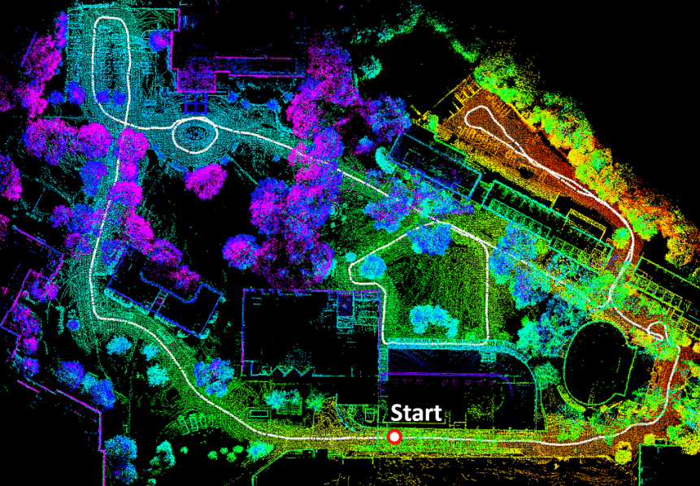

# 彻底搞懂基于LOAM框架的3D激光SLAM: 源码剖析到算法优化

本课程是3D视觉工坊的课程，课程主要结合理论和实践两大部分：理论部分将全面介绍激光SLAM的整体框架与其前端实现和后端优化的算法原理及公式推导；实践部分将以两个经典的3D激光SLAM方法为例，逐行刨析源代码让学员真正理解相关算法的实现。最后将从工程落地的角度，带学员逐渐掌握激光SLAM方法在自动驾驶领域中的应用。

注意：实践部分将提供所有实现代码和数据！

## 课程目录

- 激光SLAM简介
  + 激光SLAM概述
  + 激光雷达的工作原理
  + 激光SLAM原理及算法流程
  + 常用的激光SLAM框架及特点
    + Gmapping
    + Cartographer
    + LOAM
    + LEGO-LOAM
  + 应用数据及环境介绍
    + ROS系统介绍
    + KITTI数据介绍
  + 搭建自己的第一个3D激光SLAM程序
- 激光SLAM前端里程计精讲
  + 激光点云畸变矫正
    + 运动畸变产生原因及影响
    + 运动畸变矫正方法
  + 前端配准方法
    + scan to scan里程计求解原理及公式推导
    + ICP 与 NDT 配准算法
    + 基于特征点的配准算法
    + PL-ICP 配准算法
  + 非线性优化方法
    + 梯度下降法
    + 高斯牛顿法
    + Levenberg-Marquardt(L-M)方法
  + 激光里程计实战分析
    + 基于LOAM的激光里程计源码实现分析及算法演示
    + 基于LEGO-LOAM 的激光里程计源码实现分析及算法演示
    + 前端激光里程计改进思路
- 激光SLAM后端优化精讲
  + 激光SLAM后端优化方法
    + 后端优化方法原理
    + scan to map 讲解
  + 激光SLAM回环检测方法
    + 回环检测算法原理
    + 图优化理论介绍
    + 基于图优化的回环检测方法
  + 激光SLAM后端优化实战分析
    + 基于LOAM的后端优化源码分析及算法演示
    + 基于LEGO-LOAM的后端优化源码分析及算法演示
    + 后端优化算法改进思路
- 3D激光SLAM算法实战应用
  + LEGO-LOAM实现KITTI数据集的测试与评估
    + rosbag 包的转换
    + LEGO-LOAM 算法测试
    + 算法效果评估
  + 基于已有地图的定位
    + 基于LEGO-LOAM 进行已有地图的定位
    + 定位精度的评估
- 其它激光SLAM框架算法概述
  + A-LOAM 算法原理讲解
  + V-LOAM 算法原理讲解

公众号二维码：

[课程二维码](https://lgo.h5.xeknow.com/s/4EcnxD)：

