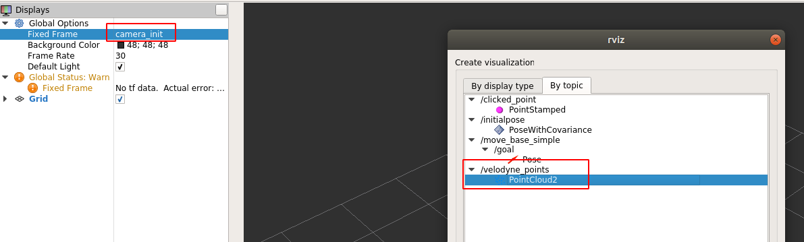
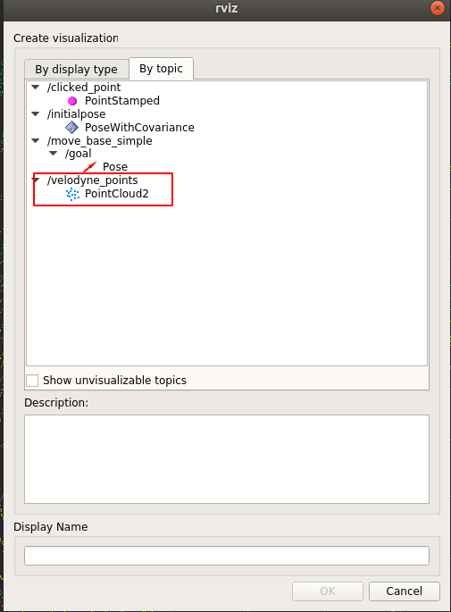
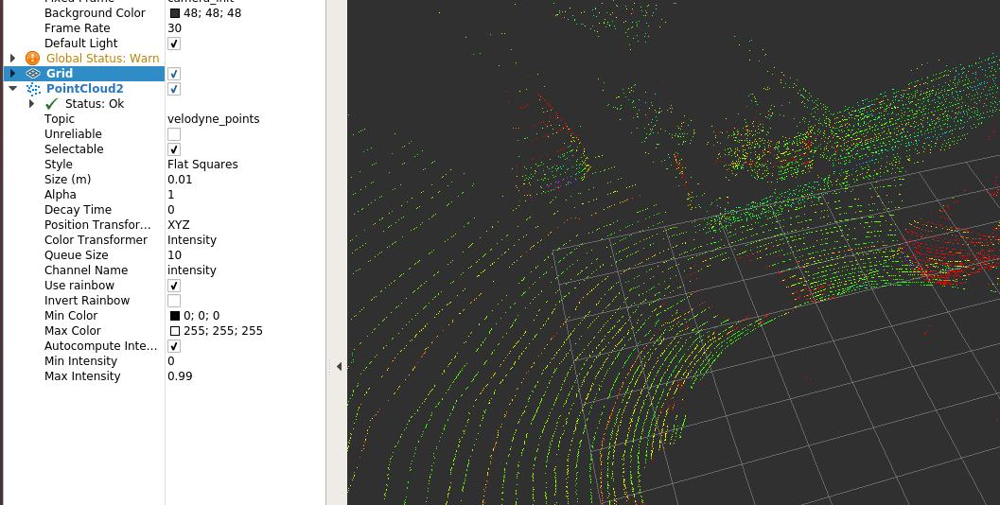

## 第一次作业

### 编译feed_kitti代码

将代码放置在共享目录中的工作空间内（放置在src目录下，和loam_velodyne平级）。

``` bash
├── 01-feed_kitti
│   ├── CMakeLists.txt
│   ├── include
│   ├── package.xml
│   └── src
├── CMakeLists.txt -> /opt/ros/kinetic/share/catkin/cmake/toplevel.cmake
└── loam_velodyne
```

然后编译

``` bash
catkin_make 
catkin_make -DCMAKE_EXPORT_COMPILE_COMMANDS=Yes . # 可选，生成compile_commands.json编译文件跳转
```

### 准备kitti数据

将kitti点云数据放置在共享目录

``` bash
├── build
├── data
│   ├── KITTI_TEST #数据集（bin格式）
│   └── nsh_indoor_outdoor.bag #数据集（bag格式）
├── devel
└── src
    ├── 01-feed_kitti
    ├── CMakeLists.txt -> /opt/ros/kinetic/share/catkin/cmake/toplevel.cmake
    └── loam_velodyne
```

### 运行程序

连接docker容器，进入工作空间后声明路径并执行程序

``` bash
source /ros_entrypoint.sh
source devel/setup.bash
rosrun feed_kitti feed_kitti_node --lidar_folder_path /workspace/data/KITTI_TEST/ # 换成你自己的文件夹
```

然后再开一个终端，进入docker容器，同样声明路径后执行rviz查看点云

``` bash
source /ros_entrypoint.sh
source devel/setup.bash
rivz
```

修改fix_frame并添加点云话题，在代码里可以修改，这里用原有的名称。

- fixed_frame
    + camera_init
- pcl2_topic
    + velodyne_points

修改fixed_frame



添加点云



结果显示

